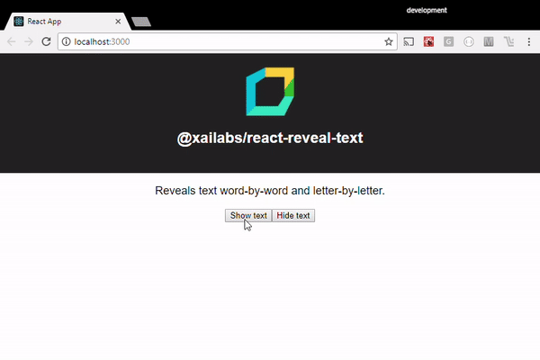

# @xailabs/react-reveal-text

Animates text by revealing it word-by-word and letter-by-letter
<center></center>

## Installation

via yarn:

```javascript
yarn add @xailabs/react-reveal-text
```

via npm:

```javascript
npm install --save @xailabs/react-reveal-text
```

## Usage


```javascript

import React from 'react';
import RevealText from '@xailabs/react-reveal-text';

export class MyComponent extends React.Component {
    render() {
        return (
            <div>
                <h3>
                    <RevealText text="My title" />
                </h3>
                <RevealText text="This is my text" />
            </div>
        );
    }
}

```

## Examples

Check https://github.com/xailabs/react-reveal-text-demo

## Options

These are the options you can specify via props:

(todo)
